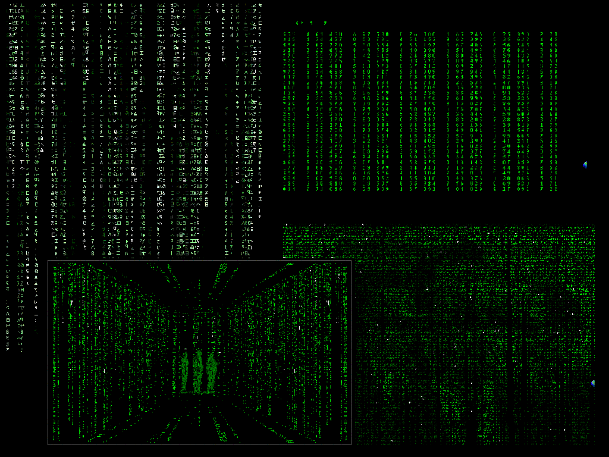



## Matrix Screensaver Collection V1\.1\.230

### Description

This is a collection of Screensavers which try to mimic the effects found in the Matrix films, there are 4 different screensavers each with lots of different ways they can be tweaked to just how you like them. It has the normal falling code, with options of Size, Colour, Speed... and the option to make it look like the code from Reloaded. It can give the effect of a picture in the falling code if you import one in or create the same effect but continous from an AVI File!! Good example to learn MCI from. It also has the call tracing effect and the computer screen moment from the first film 'Knock Knock Neo...' With this there is the end scene from the first film where Neo sees the hallway in Code. The major changes since the last version can be seen in the History.txt file, and please read the readme file before opening the project.
 
### More Info
 

             |
---                |---
**Submitted On**   |2003-06-15 17:41:56
**By**             |[Kevin Pfister](https://github.com/Planet-Source-Code/PSCIndex/blob/master/ByAuthor/kevin-pfister.md)
**Level**          |Intermediate
**User Rating**    |4.6 (23 globes from 5 users)
**Compatibility**  |VB 6\.0
**Category**       |[Graphics](https://github.com/Planet-Source-Code/PSCIndex/blob/master/ByCategory/graphics__1-46.md)
**World**          |[Visual Basic](https://github.com/Planet-Source-Code/PSCIndex/blob/master/ByWorld/visual-basic.md)
**Archive File**   |[Matrix\_Scr161120772003\.zip](https://github.com/Planet-Source-Code/kevin-pfister-matrix-screensaver-collection-v1-1-230__1-46715/archive/master.zip)

